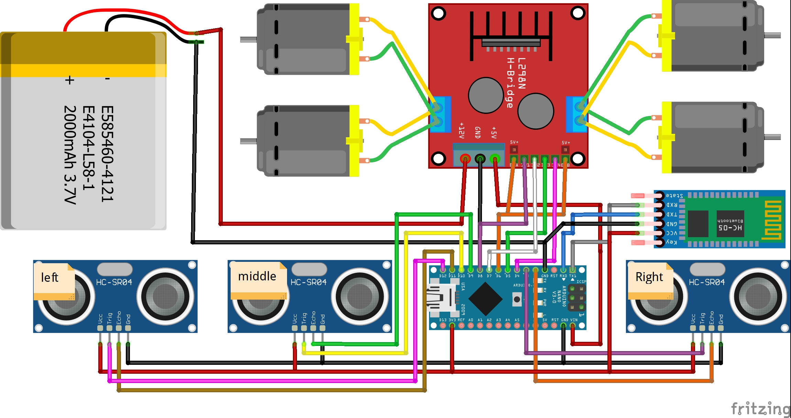

# Obstacle Avoiding Robot
This repository contains the code and documentation for an obstacle-avoiding robot car that utilizes ultrasonic sensors to detect and navigate around obstacles. The project is implemented using Arduino programming and can serve as a learning tool for understanding sensors, motors, and programming in the field of robotics.

## Table of Contents

- [Installation](#installation)
- [Usage](#usage)
- [Features](#features)
- [Configuration](#configuration)
- [Acknowledgments](#acknowledgments)
- [Contributing](#contributing)
- [License](#license)
- [Contact](#contact)

## Installation

To set up the obstacle-avoiding robot project, follow these steps:

1. Clone or Download the repository to your local machine using the following command:
```
git clone https://github.com/kershrita/Obstacle-Avoiding-Robot.git
```

2. Connect the necessary hardware components, including the motor, wheels, ultrasonic sensors, and motor driver, as per the provided circuit diagram.
- **Circuit**

- **Components**
	- 1 * Arduino Nano
	- 1 * L298N Motor Driver
	- 3 * Ultrasonic Sensor
	- 1 * Bluetooth Module
	- 4 * Wheels
	- 1 * Battery
	- 1 * Switch

3. Open the Arduino IDE and navigate to `File > Open`. Select the main project file [code.ino](code/code.ino) from the downloaded repository.
4. Connect your Arduino board to your computer using a USB cable.
5. Select the appropriate board type and port from the Tools menu in the Arduino IDE.
6. Click on the Upload button to compile and upload the code to your Arduino board.

## Usage

To use the obstacle avoiding robot car, follow these instructions:

1. Press the circular button to turn on the robot.
2. Enable Bluetooth on your mobile phone and search for the device named "HC06." Connect to it and enter the password, which is "1234".
3. Open the [Arduino Bluetooth Control](https://play.google.com/store/apps/details?id=com.broxcode.arduinobluetoothfree&hl=en) mobile app on your mobile phone.
4. Choose the name of the robot (HC06) within the app's settings.
5. Modify the button actions in the app's settings to specify the desired robot movements or actions.
6. After configuring the buttons, you can operate the robot in two modes: automatic and manual.
	- To activate the automatic mode, send the command "A" through the Bluetooth app.
        - To activate the manual mode, send the command "M" through the Bluetooth app.
        - Note: Commands are case-sensitive and should be uppercase.
7. In automatic mode, the robot will navigate and avoid obstacles based on the readings from the ultrasonic sensors.
8. In manual mode, the robot will respond to the commands sent through the Bluetooth app, allowing for direct control.


## Features

- Obstacle detection using three ultrasonic sensors placed at the front and sides of the robot car.
- Automatic mode for obstacle avoidance based on sensor readings.
- Manual mode for direct control of the robot through Bluetooth commands.
- Adjustable motor speed and distance threshold for obstacle detection.

## Configuration

The project's configuration involves defining the pin assignments for ultrasonic sensors and the motor driver, as well as setting the distance threshold and motor speed. The configuration variables are located at the beginning of the main code file [code.ino](code/code.ino)  and can be modified as per your requirements.

## Acknowledgments

We would like to acknowledge the following resources for their valuable support and inspiration during the development of this project:

- **[Arduino IDE](https://www.arduino.cc/en/software)**:  An open-source integrated development environment (IDE) used for programming Arduino boards.

## Contributing

Contributions to this project are welcome. If you have any ideas, suggestions, or improvements, please submit a pull request or open an issue in this repository. We appreciate your feedback and support.

## License

This project is licensed under the [MIT License](LICENSE).

## Contact

If you have any questions, concerns, or inquiries regarding this project, please feel free to contact us at [ashrafabdulkhaliq80@gmail.com]. We appreciate your interest and feedback.
